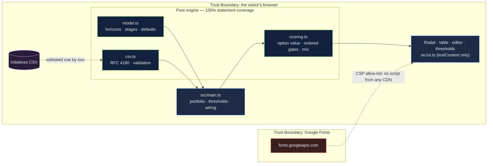

# Innovation Portfolio Radar: three horizons, option value, and a kill decision with its reason printed

[](https://github.com/Freddricklogan/innovation-portfolio-radar/actions/workflows/deploy.yml)
[](#5-getting-started--verification)
[](https://github.com/Freddricklogan/innovation-portfolio-radar/actions/workflows/codeql.yml)
[](LICENSE)
[](https://freddricklogan.github.io/innovation-portfolio-radar/)

## 1. Executive Summary & Business Impact

**Problem statement.** Innovation portfolios die of politeness. Nobody kills
the initiative a respected colleague sponsors, so it sits in "discovery" for
a year; nobody scales the one that has proved itself, because scaling means
choosing; and the money drifts toward the core because the core has the
loudest advocates. The three-horizons model and stage gates exist to fix
this and are usually applied as vocabulary rather than as rules.

**Solution & value delivered.** A portfolio console in which every
initiative carries a horizon, a stage, the money committed and asked for,
an assessed upside and probability, and the hypotheses tested and held. An
explicit, ordered gate — kill on evidence, hold on staleness or thin
evidence, scale on option-value leverage, otherwise fund — prints its reason
for each initiative. Next-stage spend is rolled up by horizon against a
target mix so the drift is visible as a gap. Thresholds and the target mix
are editable on the page, and every gate is re-evaluated when they change.
The sample is a university innovation portfolio of eight initiatives.

**[→ Read the full case study](docs/CASE_STUDY.md)**

| Outcome | How this repo delivers it |
| --- | --- |
| A kill decision nobody has to make personally | `score()` kills on evidence rate below a stated line once a minimum number of hypotheses have been tested, and says which hypotheses |
| Stale initiatives surfaced | Hold after a stated number of months in stage; the sample's idle idea is flagged at 14 months |
| Scaling by leverage, not lobbying | Scale at pilot or later when expected value ÷ next-stage cost clears a stated ratio |
| The mix made visible | Next-stage spend by horizon versus a 70/20/10 default target, with the gap in points |
| Your portfolio | CSV import with row-level validation; export |

## 2. Demonstrated Competencies & Technical Skills

- **Systems Architecture & CS** — strict TypeScript; the gate logic is a
  pure ordered function tested at every boundary (kill line inclusive,
  stale months exclusive, scale ratio inclusive); Vite build with no inline
  script so the strict CSP holds.
- **Data Science & AI** — n/a. Option value here is expected value minus
  next-stage cost, a deliberately transparent proxy stated on screen, not a
  real-options valuation.
- **Cybersecurity & Compliance** — strict CSP, no CDN scripts, validated CSV
  import, `textContent`-only rendering; typed ESLint, CodeQL and Trivy in CI.
- **EdTech & Human-Centered Design** — built from the Oxford Saïd programme
  on strategic innovation as a teaching instrument: the tour records failed
  hypotheses and watches a fund become a kill, then lowers the kill line and
  watches it come back, so the reader sees that the rule is the argument.

## 3. System Architecture & Data Flow



## 4. Technical Highlights & Engineering Decisions

### ADR-1 — Kill on evidence, and only after enough of it

**Context.** A kill rule that fires on one failed hypothesis punishes
learning; one that never fires is the status quo.

**Decision.** Kill when the evidence rate is below the line *and* at least
`minHypotheses` have been tested. Below that minimum, an initiative at
validation or later is held for more evidence rather than killed.

**Consequence.** The peer-mentoring pilot (2 of 7 held) is killed; the AI
tutoring idea (2 of 2 held) is funded to test more. Both boundaries are
pinned by tests, including the inclusive edge at exactly the kill rate.

### ADR-2 — Gate order is kill → hold → scale → fund

**Context.** An initiative can be both stale and high-leverage. Which wins
decides whether the portfolio tolerates drift.

**Decision.** Evidence is evaluated first, staleness second, leverage third.
A high-leverage initiative that has sat idle is held, not scaled, until
someone makes a gate decision.

**Consequence.** The order is documented in the panel text and in the
scoring module header; a test asserts kill beats hold beats scale.

### ADR-3 — Report the horizon mix on next-stage spend, not on counts

**Context.** Counting initiatives per horizon flatters a portfolio full of
cheap H3 ideas that never get funded.

**Decision.** The mix is computed on the next-stage cost of initiatives
gated fund or scale — the money about to move — against an editable target
that must sum to 100%.

**Consequence.** The sample shows H1 at 51% against a 70% target, which is
the honest reading: the core is under-funded relative to the stated
strategy, not over-represented.

## 5. Getting Started & Verification

**Prerequisites.** Node 22 LTS.

```bash
git clone https://github.com/Freddricklogan/innovation-portfolio-radar.git
cd innovation-portfolio-radar
npm install
npm run dev        # http://localhost:5173/innovation-portfolio-radar/
npm run check      # lint → typecheck → validate → test → build
```

**Verification — the numbers this repository actually produced:**

```bash
npm test         # Test Files 2 passed (2) · Tests 12 passed (12)
npm run coverage # All files 100% statements · 93.45% branches
npm run lint     # eslint (typed) — clean
npm run typecheck# tsc --noEmit — clean
npm run validate # html-validate index.html — clean
npm run build    # dist: no inline script or style
```

| Check | Result |
| --- | --- |
| Unit tests | **12 passed / 12** across 2 files |
| Statement coverage (engine) | **100%** (branches 93.45%) |
| ESLint (type-checked), `tsc --noEmit`, html-validate | clean |
| Headless Chrome smoke (built site) | **0 console errors**; sample gates 2 scale / 3 fund / 1 hold / 2 kill, next-stage spend $395,000, H1 mix 51% vs 70% target; tour step 3 records 3 of 8 hypotheses on the credential wallet and the gate flips fund → kill (kill count 3); step 5 lowers the kill line to 25% and the kill count falls to 0 with scale rising to 3; a target mix not summing to 100% is refused; no horizontal scroll at 400 px |

## 6. Live Demo & Production Showcase

**<https://freddricklogan.github.io/innovation-portfolio-radar/>**

No account, no backend. Sample portfolio, labelled as such.

**30-second guided walkthrough.** Press **Take the 30-second tour**.

1. **Three horizons, one chart** — stage across, horizon down, gate as colour.
2. **The gate and its reason** — the credential wallet: fund, 5.63× leverage.
3. **Evidence moves the gate** — three more failed hypotheses; fund becomes
   kill.
4. **Is the mix right?** — next-stage spend by horizon against target.
5. **The rules are yours** — lower the kill line; the gates re-evaluate.

Then edit any initiative, change a threshold, or import your own portfolio.
